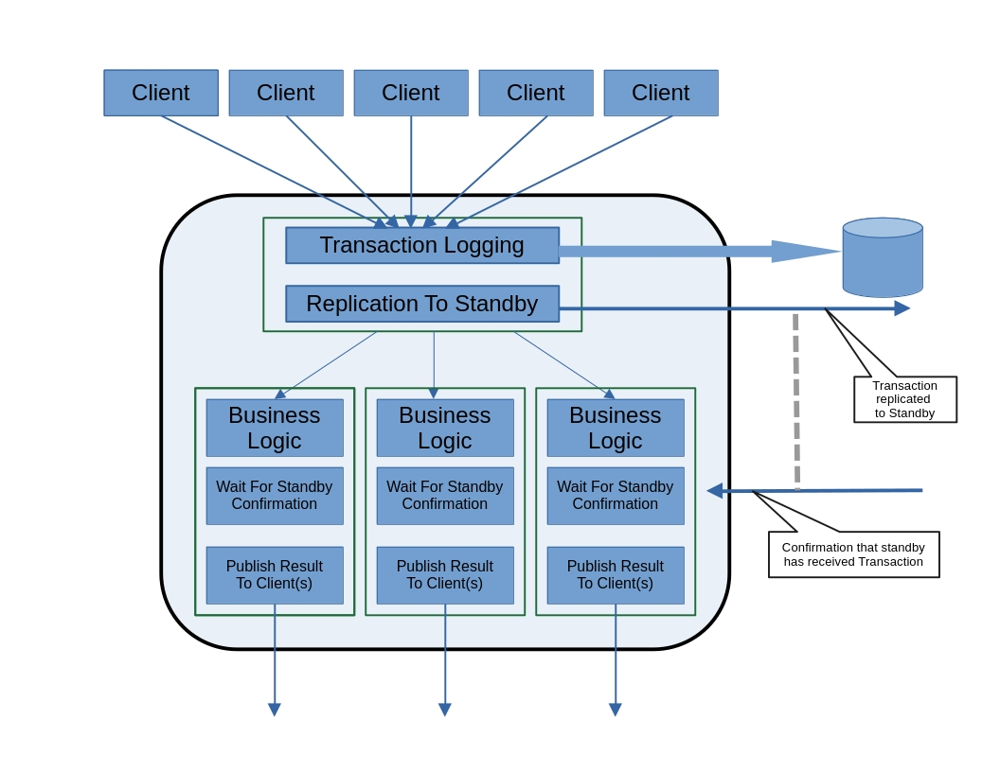

# TXTest

## About TxTest

_TxTest_ is a hobby and  proof-of-concept distributed transaction system designed for _ultra-low latency and high throughput_, achieving transactional times in _microseconds_ rather than milliseconds. Built for mission-critical applications, it prioritizes _fault tolerance, scalability, and consistency_, ensuring high availability even under substantial loads.

Such systems are commonly used in industries like _finance, telecommunications, and industrial automation_, where real-time processing and reliability are paramount.

This implementation is an _exploratory prototype_, focusing on key architectural and performance aspects rather than production readiness. Error handling remains minimal or incomplete in many cases, and mission-critical deployments of this nature require extensive testing and validation. The goal of _TxTest_ is to provide insights into the design and implementation of high-performance transaction systems—potentially serving as a foundation or inspiration for further development.

## System Overview

The system consist of three program components
- **Quorum Server,** together with *transactional servers* hereby , called TxServers are  used for determine the primary / standby roles of the TXServers. The role decisions are taking place at startup and during failure scenarios. 
- **TxServer,** is the transactional server implementing and providing the transactional business logic.
- **Client**, is emulating the clients generating transactional load on the system.

The  *Clients* generate business transactions processed by a TXServer. For each transaction  request sent to a TXServer there is a  response sent back to the client when processing of the request is completed.

## Architecture Overview

- Clients are autonomous and run in parallel. For each business transaction sent asynchronously to the system a response is sent back asynchronously to the client with the result when the transaction has been processed.
- The server business model is cached in memory. 
- Each incoming transaction is logged to  a transaction log file. 
- At  server startup the transaction log file is replayed  to recreate the latest view of the business model in memory.
- For each service there is primary and standby server, normally running on two physically separated hosts.
- The primary is receiving all incoming client transactional requests. The primary replicates the transaction the transaction over to the standby for processing in parallel.
- At start of a standby server, is synchronizing with it primary. This by catching up with the transactions logs and later with the latest transactions. 
- The system would care for single point of failure.

## Transactional Model

#### Business model 
The fundamental business model in this solution is most rudimentary. There are a number of **assets**. The assets has a **value** that are updated by client requests.  Processes of and updates from  clients is guaranteed to synchronized and atomic for an asset. 

#### Transaction Flow Overview

There will be multiple clients connected to the primary server on the systems. Clients are submitting requests in parallel, could be for the same asset. The process rule is simple, *first-come-first-served*.

1. Incoming transactions are queued asynchronously to the transaction logger, hereby aka. TXLogger.
   
2. Transactions are asynchronously queue for replication to standby server. The Standby server will when receiving a replicated transaction from the primary server, asynchronously queue a response back to the primary server indicating that the TX is received. The standby will then apply the business logic in the same way as the primary with the exception that it will not publish any feedback to any clients. This implicates that the standby executes the transaction flow in parallel with the primary and will have the same view of the business model.
   
3. After asynchronously queued the incoming transaction for tx logging and replication to standby the transaction is queued for business execution. Depending on the on the asset id the transaction is queued/scheduled onto a single executor thread.  There are multiple executor thread executing in parallel. But assets with same asset id is always scheduled onto the same executor thread and processed consecutively and atomically as they arrives. However assets with different ids may overlap and should not have any dependencies to each other.
   
4. When the transaction is executing in the executor thread the business logic is applied. *And before the response can be sent back to the client the server must wait for a confirmation from the standby that it has received the transaction.*
   
5. After receiving the standby confirmation the primary server can know publish the results to the client.
   

#### Transaction Flow Insight

###### Transaction Logging and Replication

It is essential that the transaction order in the transactional log files are the same on primary and secondary. This is essential at startup when the standby server should synchronize up with the primary. This to make sure that the correct offset is found. Otherwise it does not matter as long as transactions for the same asset id are logged in same order as they are processed.

In order to accomplish this all transaction are funneled through a synchronized single point where the transactions are queued for transaction logging and replication to standby. In the solution this happens in the method **`txloggingAndReplication`**.

###### Transaction Synchronization

In the system there will be multiple execution threads. Incoming client requests are scheduled on different execution threads and are executed in parallel.

In the system there is a  need for guarantee that update/modification of a resource or asset happens synchronized and atomically. An update or modification can be far more complex than in this proof of concept implementation however the scope of the modification is always bound to an *identifiable asset*. 

An modification of a certain recourse/asset is always executing on to a specific execution thread depending on the *resource/asset id*.

The scheduling of incoming transactions onto execution threads takes place in the method **`queueRequest`** in the **`TxExecutor`** file.

 
###### Redundancy

The standby server executes transaction in parallel with the primary and in case of the primary failing the standby will have an up to date view of the primary immediately and transparently as soon a decision that the primary is absent has been taking. 

One of the first thing the primary does is to asynchronously replicate the incoming transaction to the standby.  

The primary will then continue to process the request until it is time to reveal the result to the client and world. At this point it crucial to know that the standby server has received the replicated transaction for parallel processing.

The standby will as soon it receives a replicated transaction, send and asynchronous reply to the primary  that the transaction has been received.

###### Primary/Standby Role Decision

**Cold The server does not have any active replication it just process the transaction as they arrive without any synchronization to any backup / recovery instance.

The natural backup / recovery media would of cause to utilize disk to persist transaction. However transactions and results will be written to disk without any synchronization i.e. lazy writes / write behind caches.  In case of a crash data can be lost or corrupted if being in progress to be written to disk.  The reason for having lazy writes are;
- Crashes / failures are unlikely,
- Performance, performance, performance...
The risk is that there will be 1-5 ms of data in transition to the disk. So in case of an unlikely failure 1-5 ms of data might not be recovered.

If data is written to a RAID 1 clustered disk solution a could backup server could mount the disks and pickup from where the server stopped, with risk of not having the data being in transition.

Disk writes even if being done to disk cached memory is likely to be more expensive than a zero-copy (i.e. off loaded tcp/ip stack) tcp/ip write.  An alternative could be to send data to a backup log server just for persisting data. This will reduce the amount of that being in transit and potentially lost in case of failure,Start**

At a could start of the system there is a need to decide what nodes should be primary vs standby. If there is now history any of the two nodes can be primary or standby. In this equilibrium state the configuration (`Txserver.json`)  state outlines a preferred primary.

If there the system has a history, the server with the highest message sequence number in its transaction log will become the primary. If the nodes has equal sequence numbers the selection is done as above.

When doing a complete cold start a decision can only be made if both nodes (primary and Standby) comes online. If not a automatic decision can not be made.

**Partial Failure and Restart**

If the quorum server restarts and the primary/standby continues to execute. It will rebuild the role states by receiving the role states from the active nodes.

If the primary or standby or both  is restarted the node(s) will receive its role status from the Quorum server.

Startup of the system can be complex and require manual intervention and decisions in case of a total multiple system failure. That is not suppose to happen is assumed that these kind of system are designed and operated with under rigorous control.

## Performance Characteristics

## Considerations and Reflections

To building a system will the aim to have ultra low latency, high throughput and redundancy comes with some challenges and trade offs.

##### Latency 
The data model is cached in memory. The pros are:
- fast access, code path to access the data is kept to a minimum
- data model can easily be organized for optimal access.
- minimal overhead
Cons:
- could be a need for recreating data model in memory  when restarting. Requires that model data is persisted.

When testing the the *TxTest implementation* with one QuorumServer, two TxServers, one primary and one standby and one client application simulation 6 client connection. 

The tests was conducted on two different environments:

- A **local environment** where all applications where running on a single machine with local network connections. The machine configuration; 
	  - Intel NUC Intel i7-126OP 12 Gen,   memory 64 GB

- A **distributed environment** where all components where distributed on different physical machines. All connected via a 1 GB network, one switch. The machine configurations;
	- Quorum Server, Intel i7-960 (3.07 Ghz), memory 6 GB
	- TxServer (primary) Intel NUC Intel i7-126OP 12 Gen,   memory 64 GB
	- TxServer (standby) Intel NUC Intel i7-8559U (2.07 Ghz), memory 32 GB
	- 'Client, MAC M1, memory 16GB

In the executed test the client application simulated 6 client connections, that together sent 3 million transaction without any delay.

- ***Client end-to-end**, implicates the time from the transaction is sent to the response with the result is received from the TxServer.*
- ***TxServer end-to-end**, implicates the time from the transaction is received from the client to the response has been queued to the client.*

**Local Environment, Performance Latency**

**Client end-to-end**
Tx count: 3000000 tx-mean: 94 usec 
    tx-50 (median) : 89  usec
	1 stddev (68.27): 97     usec
	2 stddev (95.45): 133  usec
	3 stddev (99.73): 211   usec

**TX Server end-to-end**
	tx average 36 usec
	

**Distributed Environment, Performance Latency**

**Client end-to-end**
Tx count: 3000000 tx-mean: 365 usec 
    tx-50 (median) : 359  usec
	1 stddev (68.27): 387     usec
	2 stddev (95.45): 475  usec
	3 stddev (99.73): 630   usec

**TX Server end-to-end**
	tx average 132 usec

B*elow there is a typical log entry where time stamps has been collected for the various steps in the transaction flow. Besides that the timestamp logging in it self takes some time, the two steps that stands out are:*
TxEventMsgRequest **execute**            44 usec
AssetController **fromStandby**           168 usec.

This test environment is an ordinary user developer environment with no fancy CPUs or network adapter. So there is no surprise that queuing a transaction to a specific execution thread and performing a context switch is costly. Also having a high load concentrated to a specific asset group can cause contention and add to start of business execution.

One of the thing that adds to the business execution contention is that the execution needs to wait for the confirmation from the standby. For this entry the business logic waited 168 usec for the standby confirmation.

Having better connectivity between primary and standby could improve this significantly. Also having a more high CPU will in general reduce costly execution time for context switches etc. 

In this distributed test environment bouncing a message between two different machines is 
about +150 usec. Running on the test with bouncing a message within a machine is about 15-25 usec. When running locally the messages is never touching the physical network and a large part of the tcp/ip stack is never executed.

`2025-04-03 09:14:56,513 TRACE TxEventMsgRequest [TxEventMsgRequest.java pool-3-thread-4 27]`  
     `0 usec      0 usec TxCntx <init>                       32 created TxCntx`  
     `6 usec      6 usec FEController tcpMessageRead               74 added request message`  
    `10 usec      4 usec TxServer txloggingAndReplication     316 queue message to tx logger`  
    `16 usec      6 usec TxServer txloggingAndReplication     327 queue message to stdby`  
    `20 usec      4 usec AssetController publishMessageToStandby     158 enter stdby logic`  
    `34 usec     14 usec AssetController publishMessageToStandby     169 Message to standby queued`  
    `43 usec      9 usec TxServer queueInboundClientMessage   344 queued TxCntx for business processing (txloggingAndReplication : 32 )`  
    `87 usec     44 usec TxEventMsgRequest execute                      22 start TX execution`  
   `106 usec     19 usec AssetController processClientMessage        114 Update business logic`  
   `111 usec      5 usec AssetController processClientMessage        116 Business logic updated`  
   `114 usec      3 usec AssetController processClientMessage        120 Start waiting for standby reply`  
   `282 usec    168 usec AssetController fromStandby                 177 About to set replicated to standby`  
   `333 usec     51 usec AssetController processClientMessage        131 Standby replication reply received`  
   `345 usec     12 usec AssetController processClientMessage        136 start to send response`  
   `360 usec     15 usec AssetController processClientMessage        144 response sent`  
   `364 usec      4 usec TxEventMsgRequest execute                      24 end TX execution`  
`Total time 364 (usec)`

##### What is Important and What Can be Improved 

Given the model used in this test the obvious shortcoming is the connectivity between primary and standby. But also the general CPU capacity.

A more suitable  setup would be to use RoCE V2 + RDMA network to connect servers in the range 100-400 Gbps. That will eliminate the tcp/ip stack and allow zero copy transmission.  The bouncing of messages will then be less than 10 usec. This will reduce the contention for a asset execution thread significantly.

Using high end CPU will in general shave off execution time lowering the latency and increasing the throughput. Typical preferred CPU configuration are 
- AMD EPYC 9004
- Intel Xeon 4th Gen ("Sapphire Rapids"), 5th Gen ("Emerald Rapids")

To achieve Client end-to-end in the range 30-40 usec should be feasible even  with more complex business logic.

##### Resilience and Transaction Consistency
This model ensure that the current primary always have a correct view and state of the business model. Failover from primary to standby can be done instantly without and further synchronization as soon a decision has been taken that the primary has failed.

A client however may not have a a complete view in case of primary failure.
- A submitted transaction may or may not been received by the primary.
- A submitted transaction may or may have been processed completely. If the result of the transaction results in multiple updates to the client(s) some of the responses may or may not been published.
- 
Clients must be aware of failover events and are likely need to verify their engagements.

#### Throughput

The model itself supports parallel execution of transactions across multiple threads, provided that the assets involved do not belong to the same asset group. An asset’s group is determined using a simple hashing function:  
**`asset_group = asset_key % execution_threads`**.  
As the number of execution threads increases, so does the potential for parallelism.

However, there is a single point of serialization in the transaction processing flow: queuing the transaction for logging and replication. These operations are asynchronous and lightweight, and therefore do not significantly impact overall throughput.

At a broader scale, the model can be horizontally scaled by partitioning assets across multiple primary/standby pairs, potentially distributed across multiple physical nodes.

This approach requires the client to have routing knowledge—specifically, awareness of how assets are allocated to the respective servers.

An optional transaction routing layer can be introduced to simplify client interactions. This layer would consist of transaction routers that clients can connect to arbitrarily. Each router would maintain knowledge of asset-to-server mappings, including the primary/standby relationships, and route transaction requests accordingly.

While this introduces a few additional network hops, the overhead is minimal—typically around 2–4 microseconds per hop with a properly configured network setup.

#### Replication
To provide redundancy, the business state and view must be replicated to the standby node. There are several approaches to achieve this, with the primary goal being to keep the standby in sync with the primary in real time, thereby minimizing failover time.

One approach is to persist all committed transactions to a shared or clustered disk as part of the transaction processing pipeline. While modern disk technology is relatively fast, persisting data to disk still introduces significant latency.

An alternative approach—used in the current proof-of-concept—is to replicate transactions over the network. This method minimizes the impact on transaction latency while keeping the standby node synchronized and ready to take over immediately in the event of a failure. However, since every transaction must be replicated, a cold restart requires replaying the full transaction log to reconstruct the latest business state. With millions of transactions, this replay process can introduce substantial startup delays.

To address this, continuous snapshots of the business state can be taken. These snapshots can significantly reduce cold start times by providing a near-current baseline state, which only requires replaying a subset of the most recent transactions. Snapshots can also help speed up synchronization when a standby node is restarted.

However, taking frequent/continuous snapshots introduces additional computation and may negatively affect latency and throughput. That said, cold restarts are not expected to occur during normal operational hours, making this trade-off acceptable in most scenarios.

#### Startup
The most common and straightforward startup scenario is when both the primary and standby nodes start fresh. In this case, no synchronization is rThe server does not have any active replication it just process the transaction as they arrive without any synchronization to any backup / recovery instance.

The natural backup / recovery media would of cause to utilize disk to persist transaction. However transactions and results will be written to disk without any synchronization i.e. lazy writes / write behind caches.  In case of a crash data can be lost or corrupted if being in progress to be written to disk.  The reason for having lazy writes are;
- Crashes / failures are unlikely,
- Performance, performance, performance...
The risk is that there will be 1-5 ms of data in transition to the disk. So in case of an unlikely failure 1-5 ms of data might not be recovered.

If data is written to a RAID 1 clustered disk solution a could backup server could mount the disks and pickup from where the server stopped, with risk of not having the data being in transition.

Disk writes even if being done to disk cached memory is likely to be more expensive than a zero-copy (i.e. off loaded tcp/ip stack) tcp/ip write.  An alternative could be to send data to a backup log server just for persisting data. This will reduce the amount of that being in transit and potentially lost in case of failure,equired between them. The host configured as the preferred primary simply becomes the primary.

If one of the two servers fails, the designated primary continues operating normally. When the failed node is restarted, it becomes the standby and must catch up with the current state of the primary. This synchronization process can be significant, depending on how long the node was down. Additionally, the system load must be taken into account. If the primary is already under heavy load, recovery may not be feasible within a reasonable time frame. In such cases, it might be better to keep the failed node offline and wait until the end of the day or a low-traffic period to bring it back.

Introducing a form of lazy checkpointing could help reduce the recovery effort. However, if the primary is running at full capacity, even this may not be sufficient.

## Alternative Opportunistic Approach

Over the last 20 years, enterprise-grade hardware has become significantly more reliable. Estimates suggest that system-wide reliability has improved by a factor of 3 to 10 compared to two decades ago.

Today, a modern enterprise server can often operate for 5 to 10 years with minimal hardware failures—especially in controlled environments. Downtime due to hardware issues has dropped sharply, particularly in data centers that use proactive monitoring.

For certain components, such as NICs, ECC memory, and storage, well-established technologies can provide hardware redundancy—for example, NIC bonding and RAID configurations.

_Statistically, there is approximately a 96% chance that a controlled enterprise environment will not experience any hardware failures over a three-year period._

This raises the question: is it feasible to design a system without active standby servers? Ultimately, this depends on business requirements and becomes a business decision.

Building a system with ultra-low latency and high throughput that also includes active standby capabilities is complex. It demands extensive testing and rigorous engineering, and it's not uncommon for the complexity itself to become a source of downtime.

In some cases, a simpler solution may actually lead to higher software quality while reducing development, testing, and operational overhead.

A system without active standby servers may offer better latency and throughput, potentially at a lower cost.

This does not mean that the system shouldn’t include backup servers. These can be kept offline or in a passive state, ready to be configured and activated in the event of a node failure. The failover process, however, would not be seamless and would involve some downtime. Ultimately, it comes down to assessing the risk and making a business decision.

#### A Simple and Pragmatic Approach

The server does not perform any active replication. It simply processes transactions as they arrive, without synchronizing with any backup or recovery instance.

The natural backup and recovery mechanism would be to persist transactions to disk. However, both transactions and their results are written using **lazy writes** (i.e., write-behind caching) with **no forced synchronization**. This means data is buffered in memory and flushed to disk at a later time. In the event of a crash, **any data in transit**—i.e., not yet written to disk—**may be lost or corrupted**.

The rationale for using lazy writes is primarily:

- System crashes or hardware failures are statistically unlikely
    
- **Performance, performance, performance** — minimal write latency is critical
    

The estimated risk window is that **1 to 5 milliseconds of data** may be in transition at any given time and therefore could be unrecoverable if a failure occurs during that window.

In a setup using **RAID 1** or similar mirrored disk configurations, a potential backup server could mount the disks and resume from the last consistent state. However, any data still in memory or in the process of being flushed at the time of failure would likely be missing.

Even disk writes that go to disk-backed cache memory are **generally more expensive** than **zero-copy TCP/IP writes**, where data is offloaded directly through the NIC stack. As an alternative, the system could **stream transactions to a backup log server**, solely for durability purposes. This would reduce the risk window of data loss, as the data would be replicated to a secondary system before being acknowledged.

when running a test in the distributed environment with the client and primary server on different hosts, the latency and throughput significantly improved

**Client end-to-end** 
`Tx count: 3000000 
	tx-mean: 252,5 usec
	tx / sec : 23401  
	tx-50: 245  usec 
	1 stddev (68.27): 278 usec
	2 stddev (95.45): 384 usec  
	3 stddev (99.73): 495 usec`

  **Server end-to-end** 8 usec`

The same test with the client and server on the same machine i.e. short circuit the physical tcp/ip interaction.

**Client end-to-end** 
`Tx count: 3000000 
	tx-mean: 34.9 usec 
	tx / sec : 163992  
	tx-50: 33  usec 
	1 stddev (68.27): 37 usec  
	2 stddev (95.45): 50 usec  
	3 stddev (99.73): 98 usec ` 
